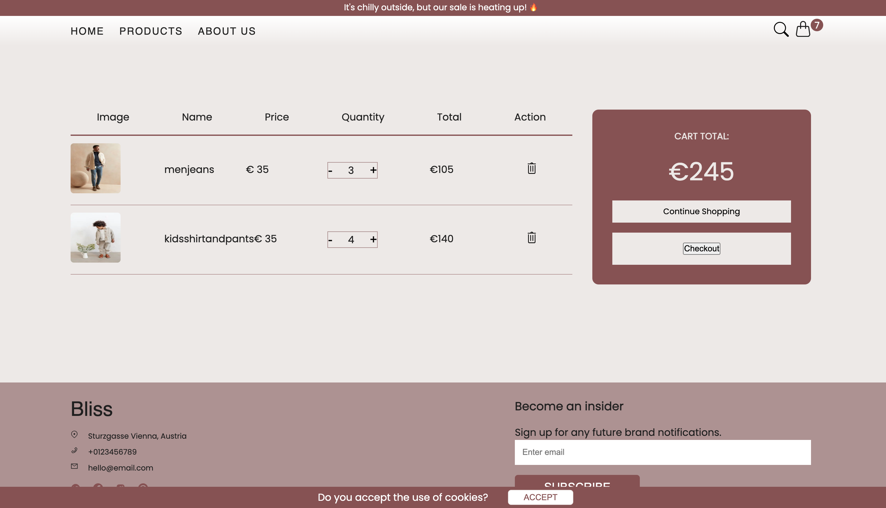

<h1 align="left">Bliss</h1>

###

Bliss is intricately designed to faithfully emulate the entire e-commerce shopping experience as a virtual storefront. It offers a lifelike simulation of real-world transactions while prioritizing user privacy and maintaining a secure browsing environment by abstaining from storing any personal data.

###

<h2 align="left">Key features include:</h2>

###

- Users have the capability to explore a variety of products and utilize filters based on categories (e.g., women, children, men). - Ordering products is streamlined, allowing users to seamlessly add items to the shopping cart. - Users can easily adjust the quantity of selected products, both adding and subtracting as needed. - Effortless removal of items from the shopping cart is facilitated. - A convenient display in the navbar keeps users informed about the current number of items in their shopping cart. - The checkout process is straightforward, enabling users to proceed from the shopping cart to the checkout page, where they can fill out a form and complete the order.

###

<h2 align="left">Technologies Used:</h2>

###

  
  
  
  
  
  
  
  
  
  
  
  
  
  
  

###

<h2 align="left">Screenshots</h2>

###
